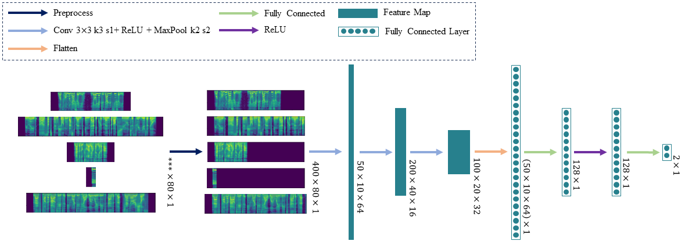
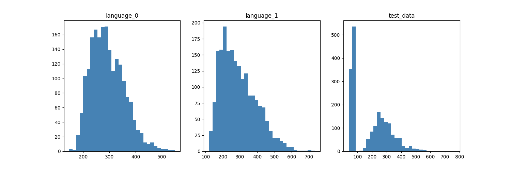
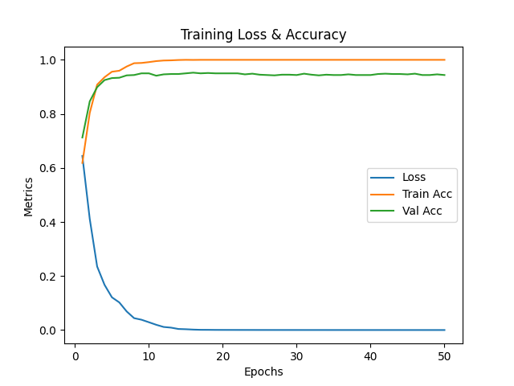

<h1 style="text-align: center;">语种识别模型项目报告</h1>

龚海瑜 23210980041

[TOC]

## 1 引言
语种识别作为自然语言处理领域的重要任务，近年来得到了广泛关注。梅尔频谱作为一种模拟人耳感知声音的特征表示方法，为语音信号的分析提供了有力的工具。结合梅尔频谱的二维数据特点，为了更好地捕捉语音中的关键信息，本项目引入了卷积神经网络的思想，将其应用于梅尔频谱数据的处理。本项目的整体架构如图1所示，梅尔频谱数据在被预处理之后，依次经过卷积神经网络和全连接层，最后输出分类结果。

<figure style="text-align: center;">
  
  <figcaption style="text-align: center;">图1: 语种识别模型的整体架构</figcaption>
</figure>

## 2 模型构建

### 2.1 数据预处理

在语种识别任务中，原始梅尔频谱数据的不同长度可能会对模型的训练产生不利影响。为了规范化数据并确保其适用于卷积神经网络（CNN）的输入要求，我们进行下列的数据预处理步骤（展示见*图1*）：

1. **统一数据长度：**由于梅尔频谱数据在时间轴上的长度差异，我们根据数据长度分布（*如图2*）设定一个固定的长度，并对过长的数据进行截取，对过短的数据以最小值填充，以确保输入数据的一致性，以便于在模型中进行有效的学习和特征提取。

2. **数据标准化：**为了提高模型的训练稳定性和收敛速度，我们对梅尔频谱数据进行了最大-最小归一化（Min-Max Normalization）处理，将数据缩放到 $[0, 1]$ 的范围内，有助于消除不同样本之间的尺度差异，使模型更容易捕捉到数据的共同特征。数学公式如下：
   $$
   X_{\text{normalized}} = \frac{X - X_{\text{min}}}{X_{\text{max}} - X_{\text{min}}}
   $$
   其中，$X_{\text{normalized}}$ 是归一化后的数据， $ X$ 是原始数据， $X_{\text{min}} $是数据集中的最小值， $ X_{\text{max}}$ 是数据集中的最大值。
   
   <figure style="text-align: center;">
     
     <figcaption style="text-align: center;">图2: 训练集语言0、训练集语言1和测试集的数据长度分布</figcaption>
   </figure>

### 2.2 卷积神经网络架构

为了有效地处理梅尔频谱数据并提取其中的关键特征，本项目设计了一个基于卷积神经网络（CNN）的模型架构（如图1）。该架构采用了多个卷积层和全连接层，以逐步提取并组合梅尔频谱中的重要信息，具体如下：

1. 卷积层：我们的卷积神经网络包括三个卷积层（*Conv 3×3 k3 s1+ ReLU*），每个卷积层的结构为，即每个卷积层都使用3×3的卷积核进行特征提取，步长（stride）为1，采用ReLU激活函数。

2. 最大池化层：在每个卷积层之后，我们引入最大池化层（*MaxPool k2 s2*），2×2的最大池化窗口，步长为2，以降低特征图的维度，保留最显著的特征，同时提高模型的平移不变性。

3. Flatten层：在经过三个卷积层和相应的最大池化层后，借助*Flatten*层将得到的特征图展平成一维向量，为全连接层的输入做准备。

4. 全连接层：模型引入一个全连接层（*Fully Connected*），并在其后跟随*ReLU*激活函数，以将卷积层提取到的高级特征映射到语种类别空间。

5. 输出层：最后模型以一个全连接层（*Fully Connected*）作为输出层，该层的节点数等于语种的类别数量。通过Softmax激活函数，我们将网络的输出转换为各个语种的概率分布，从而进行分类。

### 2.3 损失函数

本项目使用交叉熵（Cross-Entropy）作为度量分类准确率的损失函数，其是用于度量两个概率分布之间差异的一种损失函数。在分类任务中，它通常用于衡量模型的预测分布与真实分布之间的差异。在二分类问题中，交叉熵损失函数的公式通常如下：

$$
H(y, \hat{y}) = - \frac{1}{N} \sum_{i=1}^{N} \left(y_i \cdot \log(\hat{y}_i) + (1 - y_i) \cdot \log(1 - \hat{y}_i)\right)
$$

其中，$ N $ 是样本数量， $ y_i $ 是真实标签，$ \hat{y}_i $ 是模型的预测标签。

## 3 实验与结果

### 3.1 数据集说明

本项目使用的语种识别数据集的训练集包含了中文和英文2个语种的语音片段，两个类别分别有2000条语音记录；测试集包含了2000条无标签的语音片段。数据以梅尔频谱的形式表示，宽度均为80，但长度各异，训练集语言0、训练集语言1和测试集的长度分布如图2所示。为了进行模型的训练、验证，将训练数据集随机分割成训练集和验证集两部分，比例分别为80%和20%。

### 3.2 实验实现

本项目使用深度学习框架PyTorch来构建语种识别模型，损失函数为交叉熵损失，优化器为Adam优化器（学习率为0.001），批大小为100，num_workers为4，训练代数为50。运行代码的GPU为1块NVIDIA GeForce RTX 2080 Ti，训练时间时间约70秒。

本项目选择准确度（Accuracy）作为评价指标，即正确分类的样本数占总样本数的比例。为了准确评估模型的性能并减小过拟合的风险，我们采用了5折交叉验证的策略。数据集被分成5个互斥的子集，每次实验中，其中4个子集用于训练模型，而剩余的1个子集用于验证。

### 3.3 模型性能和训练过程

在训练过程中，我们监控了模型的损失函数和准确率的变化，以了解模型在训练集和验证集上的学习情况，如图3。模型在训练集和验证集上的损失函数随着训练轮数的增加而逐渐降低。这表明模型在训练过程中逐渐学到了数据的特征，并在验证集上表现出不错的泛化能力。

<figure style="text-align: center;">
     
     <figcaption style="text-align: center;">图3: 训练过程中损失函数(Loss)、训练集准确率(Train Acc)和验证集准确率(Val Acc)的变化</figcaption>
   </figure>

表1的五折交叉验证结果显示，模型在训练集上取得了接近或达到1.000的准确度，表现出强大的学习能力。在验证集上，各个折的准确度保持在0.9525到0.9725之间，显示出对未见过的数据的良好泛化性能。整体而言，模型在不同数据子集上的性能相对稳定，虽然第三折的验证准确度稍低。进一步的改进可以关注可能的过拟合情况，以及调整模型复杂度等方面。

<table>
<caption> 表 1：五折交叉验证的训练集和验证集的准确率 </caption>
	<tr>
		<th> fold number </th>
		<td> fold 0 </td>
    <td> fold 1 </td>
    <td> fold 2 </td>
    <td> fold 3 </td>
    <td> fold 4 </td>
		</tr>
	<tr>
		<th> Train Accuracy </th>
		<td> 1.000 </td >
    <td> 1.000 </td >
    <td> 1.000 </td >
    <td> 0.9959 </td >
    <td> 0.9994 </td >
	</tr>
  <tr>
		<th> Validate Accuracy </th>
		<td> 0.9700 </td >
    <td> 0.9725 </td >
    <td> 0.9525 </td >
    <td> 0.9613 </td >
    <td> 0.9538 </td >
	</tr>
</table>

## 4 结论

通过卷积神经网络在梅尔频谱数据上的训练，我们实现了令人满意的语种识别性能。经过5折交叉验证，模型在测试集展现了高准确度，验证了其对多语种的泛化能力。训练过程中的准确率提升和损失函数下降表明模型有效学习了语音特征。但训练集与测试集语音片段长度分布差异较大，测试集的准确度可能会与验证集相差较大。进一步工作可关注模型的深度和数据增强策略，以提高在特殊情况下的鲁棒性。